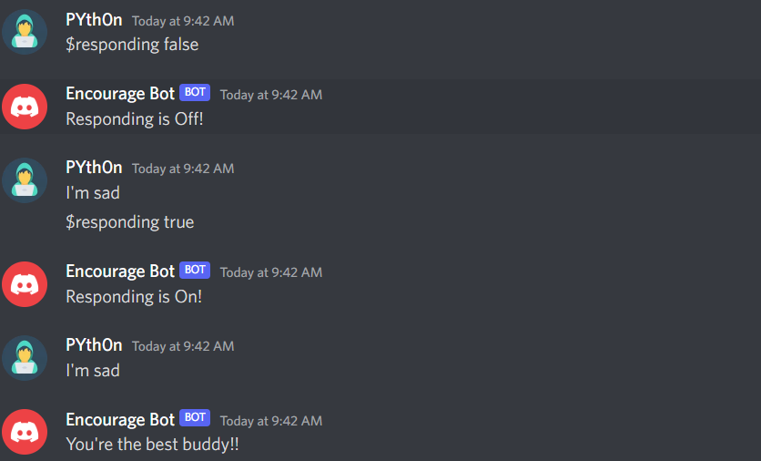

# Discord-bot
- Created and Hosted a discord bot 'Encourage Bot' on [Replit](https://replit.com/@py-Piyush) <br/>
- Sends encouraging message if any message contains sad words. <br/>
- Deployed a HTTP server using flask. Once deployed, the server will continue to run in the background, even after you close the browser tab. The server will stay awake and active until an hour after its last request
- Added a webhook which sends a message in discord if any changes happen in this repository.

## Bot commands
```
$inspire - Sends a random quote fetched from https://zenquotes.io/
```
```
$new<space><encouraging message> - Adds the encouraging message to lists of encouraging messages in the database
```
```
$del<index> - Deletes encouraging message at given index
```
```
$list - Shows the list of encouraging messages available in the database
```
```
$responding<space><true/false> - Turns On/Off responding to sad messages
```





## Reference
- [DiscordPy documentation](https://discordpy.readthedocs.io/en/stable/)
- [Freecodecamp](https://freecodecamp.org)
- [Replit Docs](https://docs.replit.com/hosting/deploying-http-servers)
